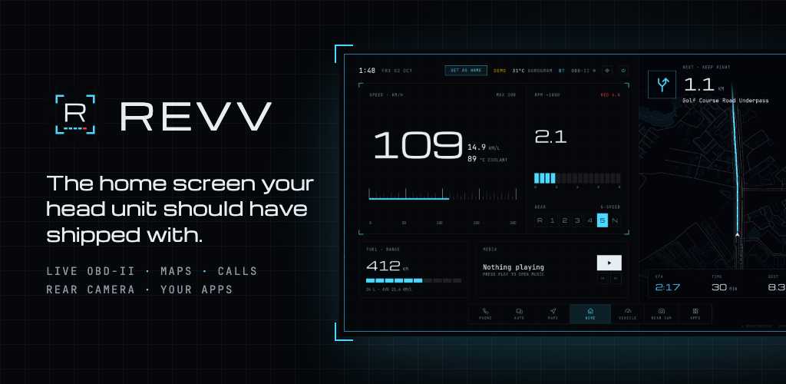
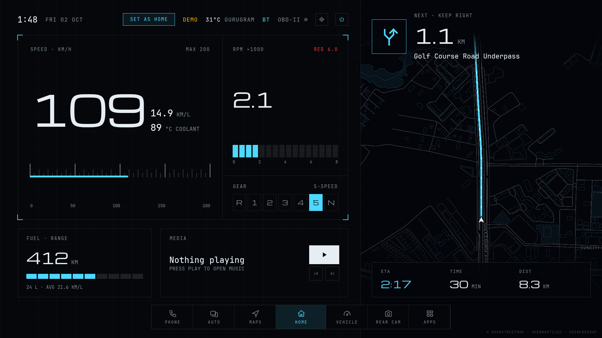
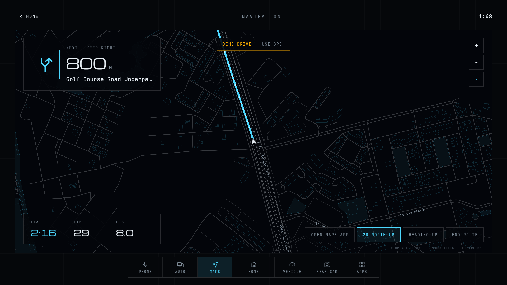
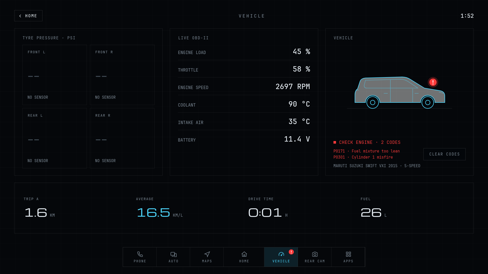
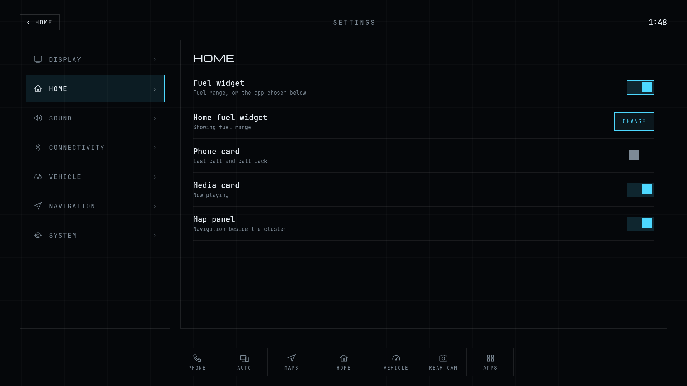

<p align="center">
  
</p>

# Revv

**A car launcher for Android head units.** Revv replaces the head unit's home screen with a dashboard built for driving: live gauges from the engine over OBD-II, maps and turn-by-turn directions, calls and contacts from your phone over Bluetooth, the rear camera and your apps, each a tap away and sized for a glance.

[Download the latest APK](https://github.com/iamvivekkaushik/Revv/releases/latest) · [Website](https://iamvivekkaushik.github.io/Revv/) · [Privacy policy](https://iamvivekkaushik.github.io/Revv/privacy.html)

## Screenshots



| Navigation | Vehicle |
| --- | --- |
|  |  |
| **Settings** | |
|  | |

The screenshots use the demo drive and the simulated OBD-II adapter.

## Features

- **Live OBD-II gauges** from an ELM327 adapter over Bluetooth, Bluetooth LE or Wi-Fi: speed, engine speed, load, throttle, coolant, intake air and battery voltage.
- **Gear indicator**, worked out from the gearbox ratios and tyre size, or learnt as you drive.
- **Fault codes** in plain English, pending codes, clearing them, and low-battery and check-engine warnings with a badge on the dock.
- **Maps and directions** on OpenStreetMap: place search, turn-by-turn routes with the next turn on the home screen, avoiding tolls, north-up or heading-up.
- **Your phone over Bluetooth**, the way a car kit reads it: recent calls, favourites, contacts with A–Z quick scroll, a T9 dialer, and calls with a call bar and end-call button.
- **Rear camera**, live from the head unit, with parking guides, rotation and camera switching.
- **Apps and projection**: every installed app, Android Auto or a projection app of your choice, and now playing from your music app.
- **CarPlay inside Revv** with the separate [RevvCarPlay](https://github.com/iamvivekkaushik/RevvCarPlay) companion app (GPL-3.0, Android 11+): the iPhone's screen runs in the Auto screen's panel, touch included, and keeps playing while you use the rest of Revv. Its settings (identity, link, iPhone, display, audio, location) live in Revv's **Settings › CarPlay**. The companion ships no Apple accessory identity; you import your own there.
- **Make it yours**: choose the home screen's cards and panels, turn the fuel card into an app shortcut, set display size (80–130%), date and time formats, sunset or light-sensor dimming, and tap sounds.
- **Demo drive**: simulated car data while no adapter is set up, so every gauge can be tried at a desk.

No account, ads or analytics. Calls, contacts, car data and the camera picture stay on the head unit; maps, routes and place search use public OpenStreetMap services ([OpenFreeMap](https://openfreemap.org), [Valhalla](https://valhalla1.openstreetmap.de), [Photon](https://photon.komoot.io)). The [privacy policy](https://iamvivekkaushik.github.io/Revv/privacy.html) has the details.

## Install

1. Download `revv-<version>.apk` from the [latest release](https://github.com/iamvivekkaushik/Revv/releases/latest) onto the head unit and open it. Android asks to allow installs from that source once.
2. Open Revv and tap **Set as home**, or pick Revv when Android asks which app should be the home app.
3. Optional: pair your phone in Android's Bluetooth settings and allow it to share contacts and call history; set up an OBD-II adapter in **Settings › Vehicle**.
4. Optional, for CarPlay: install the [RevvCarPlay](https://github.com/iamvivekkaushik/RevvCarPlay) companion, signed with the same key as Revv. In **Settings › CarPlay**, import your identity files, pick the link and your iPhone; then open **AUTO** and tap **FINISH SETUP** once to accept the companion's own prompts.

Revv needs Android 9 or newer and a landscape screen. It lays out a 1920×1080 artboard that scales to the screen, and stretches to fill wide ones such as 1920×720.

## Build from source

You need Android Studio (or the Android SDK with API 37) and a JDK to start Gradle; Android Studio's bundled JBR works. Gradle provisions the JDK 25 its daemon runs on.

```bash
./gradlew :app:assembleDebug
```

The APK lands in `app/build/outputs/apk/debug/`. Debug builds also offer a **Simulated ELM327** adapter that answers like a real one from the demo drive, and cycles through a low battery, a pending code and two stored fault codes, so the whole OBD-II path can be tried without a car.

Run the unit tests:

```bash
./gradlew :app:testDebugUnitTest
```

### Project layout

| Path | What's there |
| --- | --- |
| `app/src/main/java/com/vivekkaushik/revv/ui/hmi` | The Compose UI: home screen, the apps over it, the dock and settings |
| `…/obd` | ELM327 transports (Bluetooth, BLE, Wi-Fi, simulated), PIDs, fault codes and the polling session |
| `…/phone` | PBAP (calls and contacts) and HFP (dialling) over Bluetooth |
| `…/nav` | Location, routing, place search and guidance |
| `…/vehicle` | Car setup, gear estimation, trip computer and the demo drive |
| `…/system`, `…/media`, `…/apps` | Brightness and night dimming, now playing, installed apps |
| `site/` | The website: landing page and privacy policy |
| `fastlane/` | Lanes, Play Store listing and store graphics |

### Signed release APK

The release build is signed only when all four `REVV_KEYSTORE_*` variables are set; otherwise it is unsigned.

1. Create a keystore once (keep it and its passwords; every update must use the same key):
   ```bash
   "/Applications/Android Studio.app/Contents/jbr/Contents/Home/bin/keytool" -genkeypair -v -keystore ~/revv-release.jks -alias revv -keyalg RSA -keysize 2048 -validity 10000
   ```
2. Build:
   ```bash
   JAVA_HOME="/Applications/Android Studio.app/Contents/jbr/Contents/Home" REVV_KEYSTORE_PATH=~/revv-release.jks REVV_KEYSTORE_PASSWORD='…' REVV_KEY_ALIAS=revv REVV_KEY_PASSWORD='…' ./gradlew :app:assembleRelease
   ```
   Output: `app/build/outputs/apk/release/app-release.apk`. Use `:app:bundleRelease` for a Play bundle.
3. Check the signature:
   ```bash
   ~/Library/Android/sdk/build-tools/36.0.0/apksigner verify --print-certs app/build/outputs/apk/release/app-release.apk
   ```

## Releases

Releases are built in CI with [fastlane](https://fastlane.tools). Pushing a `vMAJOR.MINOR.PATCH` tag builds the release APK and app bundle signed with the release keystore and publishes a GitHub release with both attached (plus the R8 mapping, for reading the APK's crash logs), a changelog of the commits since the previous tag and SHA-256 checksums. A suffixed tag such as `v1.2.0-beta.1` becomes a pre-release.

```bash
git tag v1.0.0 && git push origin v1.0.0
```

The version comes from the tag: `v1.2.3` is version name `1.2.3` and version code `1002003`.

| Repository secret | Value |
| --- | --- |
| `REVV_KEYSTORE_BASE64` | The release keystore, base64-encoded (`base64 -i release.jks`) |
| `REVV_KEYSTORE_PASSWORD`, `REVV_KEY_ALIAS`, `REVV_KEY_PASSWORD` | The keystore's password, the key's alias and the key's password |
| `PLAY_STORE_JSON_KEY` | Optional: a Google Play service account's JSON key, to upload to Play as well |

With `PLAY_STORE_JSON_KEY` set, final releases also go to Google Play: the internal track unless the `PLAY_TRACK` repository variable says `alpha`, `beta` or `production`, and released straight away unless `PLAY_RELEASE_STATUS` is `draft`. Pre-releases stay off Play.

### fastlane lanes

Install fastlane with `bundle install` (Ruby 3), then run `bundle exec fastlane <lane>`:

| Lane | What it does |
| --- | --- |
| `test` | Runs the unit tests |
| `debug` | Builds the debug APK |
| `install` | Tests, then installs the debug build on the connected device |
| `release`, `bundle` | Tests, then builds the release APK or app bundle (signed when `REVV_KEYSTORE_PATH` and its passwords are set) |
| `listing` | Uploads the Play Store title, descriptions, icon, feature graphic and screenshots from `fastlane/metadata/android` |
| `play` | Builds the signed bundle and uploads it to Play: `version:1.2.0 track:internal status:completed` |
| `publish` | CI only: the GitHub release for the pushed tag |

The store icon and feature graphic are rendered from `fastlane/store-graphics` with `fastlane/store-graphics/render.sh`.

## Website

`site/` holds the landing page and privacy policy. The **Deploy site** workflow publishes it to GitHub Pages whenever it changes; set **Settings › Pages › Source** to **GitHub Actions** once.

## Credits

Maps © [OpenStreetMap](https://www.openstreetmap.org/copyright) contributors, tiles from [OpenFreeMap](https://openfreemap.org) on the [OpenMapTiles](https://openmaptiles.org) schema, routing by [Valhalla](https://github.com/valhalla/valhalla) and place search by [Photon](https://github.com/komoot/photon). Built with Jetpack Compose and [MapLibre Native](https://github.com/maplibre/maplibre-native), set in [Michroma](https://github.com/googlefonts/Michroma-font) and [JetBrains Mono](https://github.com/JetBrains/JetBrainsMono). The app's **Settings › System › Open source licenses** lists every library and its license.
